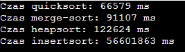

<h2 style="text-align: center;"><strong>Algorytmy i Struktura Danych - Projekt I</strong></h2>

 
<h3><strong>Opis zadania:</strong></h3>

 Projekt polega na porównaniu czasu działania algorytmów sortujących. 

Alg1- heapsort

Alg2- quicksort (wersja Lomuto z zajęć)

Alg3- merge-sort

Alg4- dowolny (jeśli nie był omawiany na zajęciach dodatkowo potrzebny będzie opis)

Zmierz czas działania poszczególnych algorytmów na danych wejściowych. Zadbaj o to, aby dane wejściowe były takie same (tzn  losuj raz! ). Tablice nie powinny być krótkie - ok 300tys - 500tys elementów. 

Po wypełnieniu tabelki napisz wnioski, które z niej wynikają. Np "najlepiej działa algorytm...", "najgorzej zachowuje się algorytm..."  - co było zgodne z oczekiwaniami, a co nie.

Kod programu umieść w repozytorium. Link wyślij z rozwiązaniem. Do rozwiązania dołącz tabelkę oraz wnioski.

 

 
<h3 style='text-align: center;'><strong>Każdy algorytm na początku robiłem na pojedyncze pliki. W pliku main.cpp znajdują się wszystkie algorytmy sortujące i korzystają one z jednej raz losowej tablicy.</h3>
 
<h3 style='text-align: center;'> Przykładowe zmierzone czasy poszczególnych algorytmów na tej samej wylosowanej tablicy - tablica składa się z 300tys. elementów.</h3>
 

 
<h3 style='text-align: center;'> Jako czwarty algorytm zostało użyte sortowanie przez wstawianie (Insertion sort). 
Jeden z najprostszych algorytmów, który odzwierciedla zasady w jaki sposób ludzie ustawiaja karty - kolejne elementy wejściowe są ustawiane na odpowiednie miejsca docelowe.</h3>
 
<h3 style='text-align: center'> Wnioski oraz 2 kolejne przykłady czasów z większa ilością elementów w tablicy można zobaczyć w pliku "Wnioski.docx" dołączonym do tego repozytorium.</h3>

  

<footer> Filip Bianga s19329